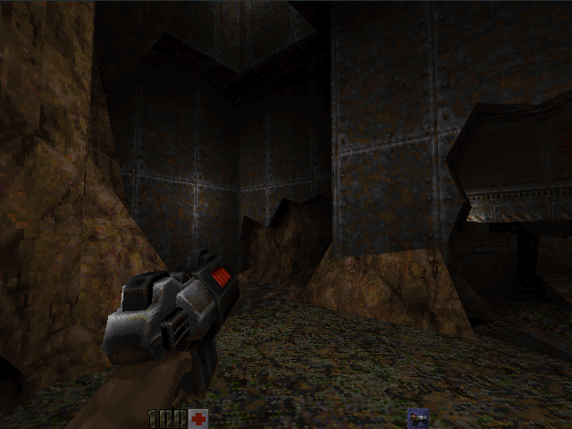

# qengine

qengine is a cross-platform retro game engine. It is aimed at nostalgic game
developers that miss simple times and enjoy creating games like it's 1997. The
software renderer provides the aesthetic that we all love and the engine
limitations exist to make your creativity shine.

The engine is a fork of the Quake II codebase that focuses on serving as a base
for standalone games. Unlike other ports, it does not aim at being compatible
with mods or the base Quake II game. In fact, many features were removed to
reduce the complexity of the codebase and make the process of creating new
games on top of the engine easier and faster.

Some notable changes include:

- Removal of overly specific gameplay code, such as enemies and weapons
- Merge of modules into a single package. No more DLLs, just a single
executable for client and another for server
- Removal of OpenGL
- Minimal dependencies

## Free, open source and community-driven
qengine stands on the shoulders of giants from the Quake II community. The code
is built upon Yamagi Quake II, which itself contains code from other amazing
projects:

- Hecatomb
- Icculus Quake 2
- KMQuake2
- Q2Pro
- QuDoS
- r1q2
- stereo quake
- zeq2

## Goals
- Provide a clean and maintainable base game engine
- Improve stability across different platforms
- Enhance the software renderer
- Improve documentation of asset pipeline

## License
qengine is released under the terms of the GPL version 2. See the LICENSE
file for further information.

## Compiling

    $ mkdir build
    $ cd build
    $ cmake ..
    $ make

## Running
The engine will look for game data in the `assets` folder. You can start from
scratch, or use the original Quake II game data if you own it.

## Tools
Included with the engine there are quite a few useful tools. They are:

### Mapping
- qbsp3
- qrad3
- qvis3
- bspinfo

### Textures
- pcx2wal
- pcx2pal
- colormap
- 16to8
